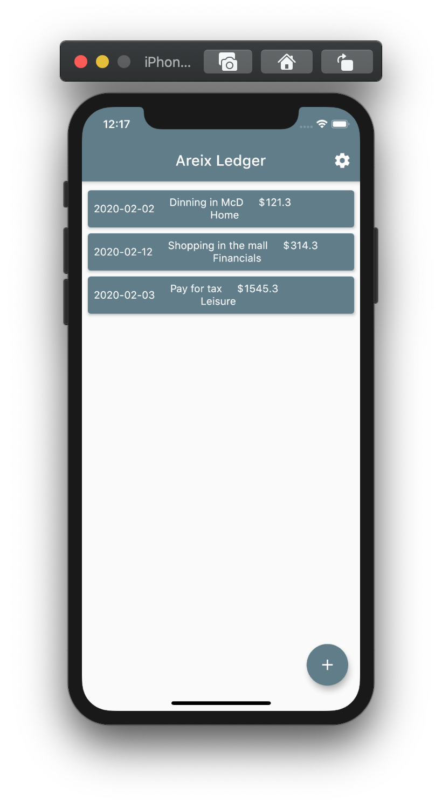
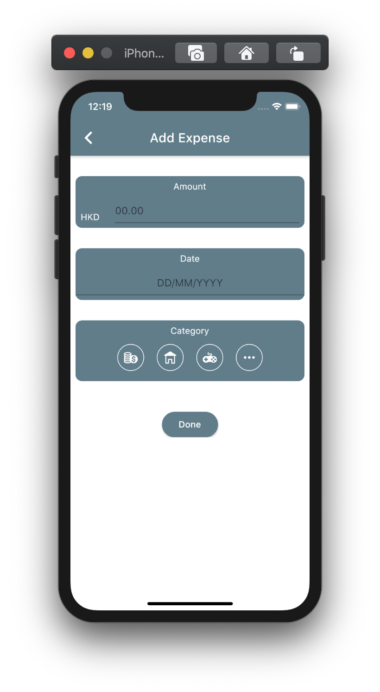

# Introduction

Areix Ledger is an expense tracking mobile application which records the user expenses and creates an analytical view based on these expenses. Features include:

- categorizing expenses
- calculating and analyzing user expense
- allows user to perform sorting and filtering

# Requirements

- Use Flutter / React Native / Native Android/IOS  (If using Flutter, the UI code is provided)
- State Management (**IMPORTANT**)
- API Integration
    - If you completed the backend assessment, it is highly recommended to invoke your own API endpoints which you have developed in the backend assessment.
    - Otherwise you could use our mock up API endpoint: https://my-json-server.typicode.com/Areix/technical-assessment/expenses

# Task 1
Build a frontend page with filter which allow users to filter and see expenses.

<!-- 

 -->

- When user create a new expense record in the `Add Expense Page`, the `Expense List Page` will be updated accrodingly and display the new record
- Implement the sorting and filtering in the frontend page. 
bool  check filter
filter by what
empty list to store the filtered data
    1. Filter by `category`
    2. Sort by `created_at`
    3. Filter by month (refer to `created_at`)

# Task 2 (Bonus task)
Build a frontend page which generate the bar/line/pie chart based on the user expenses for user better understanding their expense behaviour.

- The charts should be compatible with filtering 
- The charts shoud be dynamic, whcih means once a new expense record is added, the charts are expected to change accordingly
